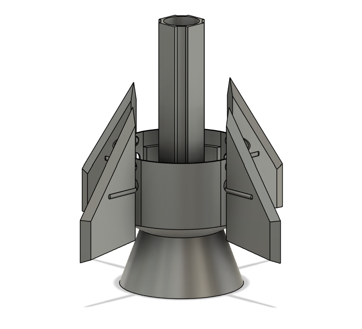

# Rocket Project V1

### First Off
This fully functional model rocket project requires these modules:
* **Arduino Uno R3** (to be honest, it doesn't matter which version of Arduino you use. Nano would be better tho):
* **MPU6050** (Gyro and Acceleration Sensor)
* 4x **MG996R** Servo Motor (High Torque)

**And that's it. Not really actually, we still need fuel to make the rocket go. I'm pretty sure the best option for propellant is a mixture of KNO3 + Sugar
as known as Rocket Candy (check Wikipedia for mentioned amateur rocket engine: https://en.wikipedia.org/wiki/Rocket_candy).**

## **Images of my STL files are down below.**

#### COMPLETE BODY

#### ROCKET BOTTOM

#### FINS

## CAUTION

> Please be careful while doing this project (I don't know why i have to tell you this but hey im pretty sure that you are aware about this Rocket Candy thing right?... RIGHT!? -- If not please handle it with extreme care.)
>

