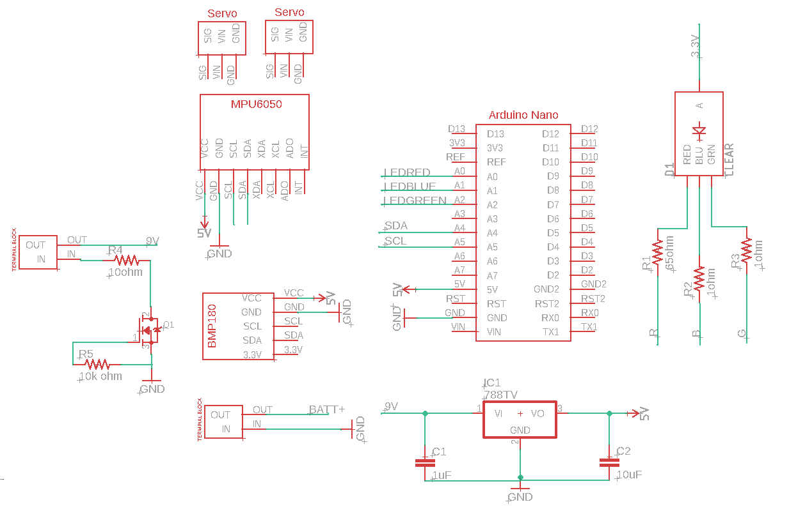

# Disclaimer
This project is intended solely for educational and hobby purposes. The creator of this project is a student with a strong interest in space vehicles and rocket technology. The goal is to learn and share knowledge about model rocketry in a safe and responsible manner.

## **About Manual Controller**
**I'm considering modelling a TVC (Thrust Vector Control) Mount for RocketV2 because 4 high-torque servos are horribly heavy. With a TVC Mount, I can reduce it to 2 servos, just for the X and Y axes. That's why I coded a manual controller, to test and control the servos with my joystick, making it easier to integrate the limits into the model.**
>I thought it might also be good to have the ability to control it manually in case of emergencies like airbrakes, drag chute for safe landing etc, so I might add more buttons and functions in the future. (Check my TVC design below -nearly done-)
UPDATE: Since high torque motors are heavy, i designed the TVC mount for 9g servos.
>
>

## **About Flight Computer**
**As part of my TVC (Thrust Vector Control) RocketV2 project, I've designed a detailed flight computer schematic. The schematic includes connections for an Arduino Nano, MPU6050, and BMP180 sensors. To create this schematic, I had to make some custom .lbr files for the Eagle program, as they aren't available online.**  
>If you're interested in these files, you can find them in the `flightComputer` directory of this repository. Also check schematic (basic outline for now) down below.
>
>

## **Image of my first iteration of rocket1003.**

>I am currently working on next iteration with a TVC system.
>
## CAUTION

>

Please be careful while doing this project (**handle it with extreme care**.)
