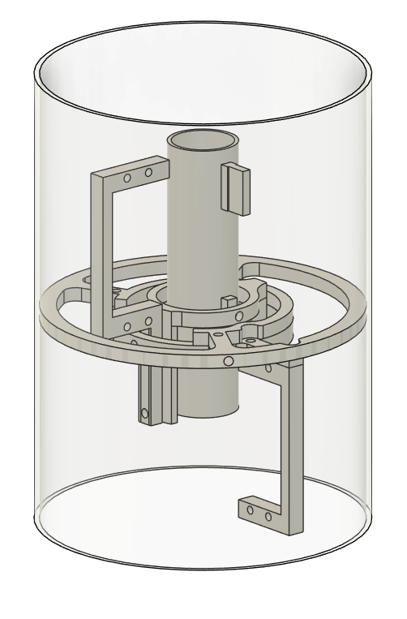

# Disclaimer
This project is intended solely for educational and hobby purposes. The creator of this project is a student with a strong interest in space vehicles and rocket technology. The goal is to learn and share knowledge about model rocketry in a safe and responsible manner.

# Rocket Project V1

### First Off
This model rocket project requires these modules:
* **Arduino Uno R3** (to be honest, it doesn't matter which version of Arduino you use. Nano would be better tho):
* **MPU6050** (Gyro and Acceleration Sensor)
* 4x **MG996R** Servo Motor (High Torque)

**And that's it. Not really actually, we still need fuel to make the rocket go. I'm pretty sure the best option for propellant is a mixture of KNO3 + Sugar
as known as Rocket Candy (check Wikipedia for mentioned amateur rocket engine: https://en.wikipedia.org/wiki/Rocket_candy).**

## **About Manual Controller**
**I'm considering modelling a TVC (Thrust Vector Control) Mount for RocketV2 because 4 high-torque servos are horribly heavy. With a TVC Mount, I can reduce it to 2 servos, just for the X and Y axes. That's why I coded a manual controller, to test and control the servos with my joystick, making it easier to integrate the limits into the model.**
>I thought it might also be good to have the ability to control it manually in case of emergencies like airbrakes, drag chute for safe landing etc, so I might add more buttons and functions in the future. (Check my TVC design below -nearly done-)
>
>

## **Images of my RocketV1 STL files are down below.**

#### COMPLETE BODY

#### ROCKET BOTTOM

#### FINS

## CAUTION

>

Please be careful while doing this project (**handle it with extreme care**.)
